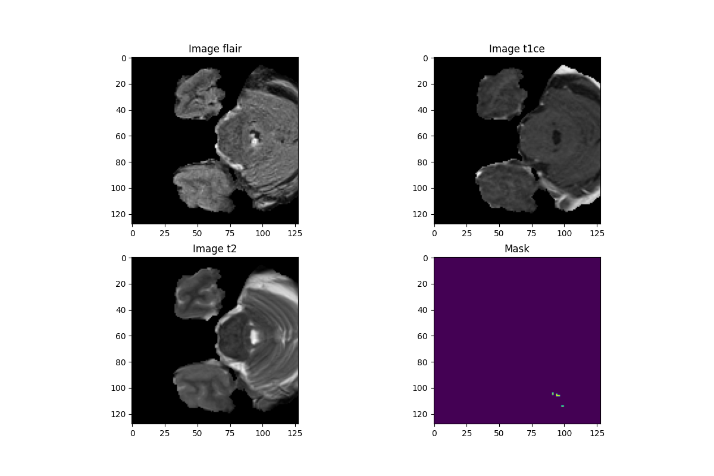

# Brage

Brain MRI Preprocessing 🧠🧠





### Bootstrap

```
    make env
```

```
    source env/bin/activate
```

```
    make check
```

```
    make test
```

### Packages

- NiBabel
- NumPy
- Matplotlib
- Scikit-learn


### ToDo

- [x] Removing background
- [x] Removing slices with no information
- [x] Cropping images
- [x] Removing useless masks
- [ ] Adding image metrics
